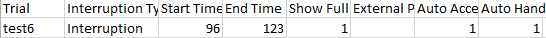

# Phase Two

This is the guide to the second phase of the macro development. Most of
the basic information will remain the same between this guide and phase
one. This guide will provide instructions on extracting the following:

  - Workload data

  - Handoff/acceptance information

  - Conflict information

  - N-back

  - Dismiss message check

# Key information and Files

## Key Files

  - outputsheet\_phase2.5.xlsx = an example of the output sheet from
    which the macro will print to. Same as before but different
    variables
    
      - **NB**: The colouring of the file headings is just used to make
        more clear distinctions between sections. Colours don’t hold
        great significance.

  - outputsheet\_phase2.5\_VERTICAL.xlsx = an example of the output
    sheet from which the macro will print to transposed (as you liked
    it).

  - Dismiss\_check.xlsx = used to check the dismiss message section
    (7.0)

  - ATC\_Golf\_Participant1.xml.csv = an example of the raw data from a
    participant

  - PM\_sheet1.5.xlsx= the list of exceptions of PM aircraft and number
    of aircraft in each scenario. Also contains the timings of
    interruptions. Should be same as one you already had

  - Resumption\_sheet2.5.xlsx = list of all resumption aircraft (same as
    before)

  - conflictdata\_phase2 = this contains a list of all the aircraft
    which are officially involved in a conflict in the task.

## Key Definitions

  - Output sheet Refers to the spreadsheet which the macro will output
    data to (e.g. outputsheet.xlsx)

  - Raw data sheet Refers to raw participant data from which the macro
    will be extracting information from. (e.g.
    ATC\_Golf\_Participant1.xml.csv)

## Structure of experiment/raw data files *(same as 1.4)*

### Basic Trial/test information

  - Participants complete a total of 15 trials/tests in the experiment

  - Each raw data sheet is grouped into these 15 trials/tests.

  - The trial number is indicated in column A. The order of trials
    changes in each data file.

  - In ATC\_Golf\_Participant1 (example) the trial ordering can be seen
    in column A of the data sheet.
    
    1.  test12
    
    2.  test13
    
    3.  test5
    
    4.  test14

## “Interruption Condition” *(same as 1.4)*

  - There are three “interruption conditions” which are randomly
    assigned to each trial participants complete. These are conditions
    are “**nback**” “**blank**” and “**none**”.
    
      - In the nback and blank conditions participants are interrupted
        from performing the task for 27 seconds.

  - The information regarding interruptions is below the be access in
    the area as seen below:  
      
    

  - The trial column indicates what test/trial number the interruption
    occurred in

  - The Interruption Type column indicates what interruption condition
    appeared, according to the following rules:
    
      - If “Interruption” this means the interruption type was:
        **blank**
    
      - If “Nback” this means the interruption type was: **nback**
    
      - If there is no data, this means the interruption type was:
        **none**

  - The start time is the time the interruption started (in case of
    blank and nback). This information is used for calculating
    acceptance/handoff (see Acceptance/Handoff) and conflict information
    (see Conflicts).

  - The end time is the time the interruption ended (in case of blank
    and nback). This information is used to calculate “resumption time”
    (see 6. Resumption Time), as well as for calculating
    acceptance/handoff (see Acceptance/Handoff) and conflict information
    (see Conflicts).

## Output sheet differences

After consideration, I have decided not to include any of the Phase 1
variables in the Phase 2 output (other than participant number).

# Workload

  - Participants are asked two questions (question 1 and question 2) at
    the end of the experiment about their “*workload*”. They must
    respond with a number from 1 – 10.

  - There are 30 questions asked in total in the experiment (Q.1 and Q.2
    for all 15 trials)

  - The two columns in the raw data file are “Recall No” and “Text
    Entered”.
    
      - Recall No is the “question number” in terms of raw ordering
        (i.e. the first question asked in the entire experiment, through
        to the 30th question asked in the entire experiment).
        
          - For the first 12 participants I believe this remained at 1
            for all questions (this was a bug). For the remainder, this
            changed from 1-30.
            
              - This may mean that it is not that meaningful to look up
                question responses based on the recall no.
        
          - The first item in the list **always** corresponds to the
            first question asked (Question A)
    
      - Text entered is the data I need to output to the sheet.

  - Output these numbers to the corresponding columns (workload1,
    workload2)

  - I also need the averages of these output for each condition.
    (M\_workload1, M\_workload2)

  - The first item that appears in the raw data output always
    corresponds to workload1, second to workload2

# Acceptance/Handoff

## General Info: Reading the Data File

The acceptance/handoff data is the first major ‘chunk’ in the raw data
file. Acceptances are in the first section - then separated by a blank
row are the handoffs are in the second section. Some columns have
similar names but one will be measuring in seconds and the other
milliseconds.

All variables which will be used in the analysis have been indicated
below in blue. Letters denote the column which the variable appears in.

2.  ‘Flash time’ in column B indicates the time (in seconds) that an
    aircraft begins to flash on the screen.

3.  ‘Flash Time (HP)’ in column C is the time that an aircraft begins to
    flash on the screen in milliseconds.

4.  ‘Flash CS’ in column D is the call sign of that aircraft.

5.  ‘Type’ in column E indicates whether the aircraft were coming into
    the sector (and needed ‘accepting’) or were leaving the sector (and
    needed to be ‘handed off’).

6.  Automatic indicates whether or not the acceptance/handoff was
    automatically managed by the software. This relates to exclusion
    criteria.
    
    1.  **If any aircraft has an automatic value of 1 then exclude
        them.**

7.  ‘Selection Time’ in column F indicates the time when the participant
    clicked on the aircraft in seconds. This can be ignored.

8.  ‘Selection Time (HP)’ in column H indicates the time when the
    participant clicked on the aircraft in milliseconds.

9.  ‘Key pressed’ is the key they pressed.

10. ‘Time’ is the time they clicked on the aircraft in seconds

11. Time (HP) is the time they clicked on the aircraft in milliseconds

12. ‘Acceptance Time’ is the time the aircraft was accepted/handed off
    in seconds.

13. ‘Acceptance Time (HP)’ is the time the aircraft was accepted/handed
    off in milliseconds.

14. A ‘1’ in the ‘Error’ column indicates that the participant missed
    the handoff/accept

15. Error total is the total number of errors for handoffs and accepts

16. Score is the score for that trial

## General Info: Pre/Post Division

  - As an interruption occurs in roughly the middle of each trial, we
    need to assess **only** the scores of aircraft (*on
    acceptance/handoff performance*) before and after this interruption.
    
      - This also applies to the none condition (even though they were
        not interrupted)

  - Furthermore, we need to separate (for the purpose of analysis) pre
    and post aircraft (aircraft events that occur before and after the
    interruption, respectively)

  - The times of each interruption are in an excel file called
    resumption\_sheet2.5.xlsx

  - Looking through outputsheet\_phase2.5\_VERTICAL.xlsx should make it
    pretty clear how the pre-int/post-int system works as well

  - *I think the easiest way to do this (for the sake of future
    analysis) is to make a new column in each raw data analysis which
    identifies an aircraft as pre, post, or interruption for each trial.
    This doesn’t really concern me at all if this is not done.*

### Note on Splitting:

  - **NB:** some aircraft will appear in both acceptances and handoff
    section (as participants accepted **and** handed off these
    aircraft). This means that their acceptance may be classified as a
    pre, and their handoff classified as a post (basically this means we
    cannot simply categorise based on aircraft call sign).
    
      - However, more importantly – for some aircraft which perform both
        acceptances and handoffs, one of these actions may be performed
        automatically during the interruption. This means when (see
        below) exclusion criteria for an aircraft is “Automatic = 1” –
        this actually means just that single event. So if you excluded
        an **acceptance** because it was automatic, you wouldn’t then
        also exclude the non-automatic **handoff**. (See Video).

### Specific Splitting Rules:

  - In each trial, aircraft whose flash time (in seconds, column B)
    occurs prior to “Int Start” \[column H: resumption\_sheet2.5.xlsx\]
    need to be extracted as “pre” aircraft (*UNLESS THEY HAVE 1 in the
    Automatic column)*.

  - Aircraft whose flash time (in seconds, column B) occurs after “Int
    Stop” \[column I: resumption\_sheet2.5.xlsx\] need to be extracted
    as “post” aircraft.

  - All aircraft remaining should be automatic aircraft and thus are
    excluded from all analysis.

## Acceptances/Handoff Exclusions

### Handoff Exclusions

  - A list of aircraft has been attached which indicate special ‘PM’
    aircraft for each trial and these are to be excluded. This file is
    called ‘PM\_sheet’. (This is same from Phase 1)

  - Any aircraft that are NOT PM aircraft but with “key\_left” or
    “key\_right” or “key\_up” or “key\_down” in the first ‘Key
    Pressed’ column for a trial are called handoff false alarms (as
    Per Phase 1). These are to be excluded from handoff analysis (other
    than where specifically stated it is needed).

  - Any aircraft in which the flash time occurs in between the “Int
    Start” \[column H: resumption\_sheet.xlsx\] and “Int Stop” \[column
    I: resumption\_sheet.xlsx\] AND any aircraft which has a 1 in the
    automatically column (this is already likely covered by 4.2.2).

### Acceptance Exclusions

  - Any aircraft in which the flash time occurs in between the “Int
    Start” \[column H: resumption\_sheet.xlsx\] and “Int Stop” \[column
    I: resumption\_sheet.xlsx\] AND any aircraft which has a 1 in the
    automatically column (this is already likely covered by 4.2.2).

## Acceptance/handoff Reaction Time

  - Calculate the average acceptance and handoff reaction time for pre
    and post, for each trial.  
    Formula = Acceptance Time (HP) - Flash Time (HP) (e.g. example data
    file trial 12 it is: column M – column C note specific columns may
    change between trials).

  - Aircraft that are misses need to be excluded from the Reaction Time
    data and are **not** included in the denominator for calculating the
    averages.
    
      - *To detect misses: find aircraft with no value in the Acceptance
        Time (HP) column and with a 0 in the Automatic column. *

  - Output the average pre **and** post acceptance/handoff time for each
    trial in the corresponding column in the output sheet (using the
    same condition method as usual)

  - Finally, for each variable I will also need a total “true” average
    for each condition (which is not just the average of the averages).
    This is calculated by gathering the total acceptance & handoff
    reaction time (for pre/post in each condition) and dividing by total
    number of aircraft (for pre-post in each condition).
    
      - (NB: Ensure as per exclusion criteria that excluded aircraft
        (e.g. PM, misses, and automatic aircraft) are not included in
        this true average denominator.)

  - The outputs for the total averages look as follows:
    
      - Note: Condition, PreInt/PostInt, Handoff vs Accept (3\*2\*2=12).

| NbackM\_PreInt\_Handoff\_ReactionTime  |
| -------------------------------------- |
| BlankM\_PreInt\_Handoff\_ReactionTime  |
| NoneM\_PreInt\_Handoff\_ReactionTime   |
| NbackM\_PostInt\_Handoff\_ReactionTime |
| BlankM\_PostInt\_Handoff\_ReactionTime |
| NoneM\_PostInt\_Handoff\_ReactionTime  |
| NbackM\_PreInt\_Accept\_ReactionTime   |
| BlankM\_PreInt\_Accept\_ReactionTime   |
| NoneM\_PreInt\_Accept\_ReactionTime    |
| NbackM\_PostInt\_Accept\_ReactionTime  |
| BlankM\_PostInt\_Accept\_ReactionTime  |
| NoneM\_PostInt\_Accept\_ReactionTime   |

## Acceptance/handoff Miss Proportion

  - Sometimes participants will fail to respond to an accept/handoff

  - The metric used for calculating misses is the miss proportion:
    the total number of times (in each
    time block (i.e. pre/post)) for each trial, that a participant has
    an aircraft with no value in the Acceptance
    Time (HP) column divided by the total
    number of aircraft in that time phase of the trial.
    
      - i.e. total misses/total number of aircraft (completed for
        pre/post & condition & trial)
    
      - Therefore, there are 4 variable groups corresponding to this
        
          - PreInt\_Handoff\_Misses
        
          - PreInt\_Accept\_Misses
        
          - PretInt\_Handoff\_Misses
        
          - PostInt\_ Accept\_Misses

  - As per normal, for each variable I will also need a total “true”
    average for each condition (which is not just the average of the
    averages). This is calculated by gathering the totals number of
    misses (for each condition/pre\&post/accept\&handoff) and dividing
    by total number of aircraft (for each
    condition/pre\&post/accept\&handoff). Outputs for the averages look
    as follows:

 

# Conflicts

  - In each trial, predetermined pairs of aircraft ‘conflict’ (i.e. get
    too close) with each other and when this happens they turn yellow on
    the screen.

## Reading the Raw data Sheet

  - In the raw data sheets, you can find all the aircraft a participant
    responded to in each trial in the “intervene section”.

  - The data associated with conflicts is the smaller section at the
    bottom of each trial that has the labels ‘intervene time’,
    ‘Intervention Time (HP)’, ‘Intervention Time (HP)’ ‘Intervene CS’,
    ‘Level’ and ‘Missed’.
    
    
    
      - ‘Intervene Time’ (located in column A) - The time elapsed for
        that trial (in seconds) when they intervened with the aircraft
    
      - ‘Intervene Time (HP)’ (located in column B) - The time elapsed
        for that trial (in milliseconds) when they intervened with the
        aircraft
    
      - ‘Intervene CS’ (located in column C) - The list of aircraft,
        identified by their call sign (CS) number, that participants
        intervened with because they thought they would conflict with
        another aircraft
    
      - **Keep in mind that they only needed to change the altitude of
        one aircraft out of the pair to ensure they did not collide.**
    
      - Level is the altitude it was changed to (ignore this)
    
      - Missed is how many conflicts they missed in total in the trial.
        (ignore this)

## Reading the conflict data sheet

  - There is a separate excel file containing the pairs of aircraft that
    conflict in each trial (conflictdata\_phase2.xlsx). The file is
    sorted as follows:
    
      - Trial – the trial number that the conflict occurs in
    
      - CS1 – the call sign of the first aircraft in the conflict
        (1st/2nd is arbitrary)
    
      - CS2 – the call sign of the second aircraft in the conflict
    
      - Time 1 (T1) - The first opportunity (in seconds) for
        participants to intervene with the aircraft to prevent the
        conflict (by changing the altitude of the aircraft)
    
      - Time 2 (T2) – The point in time (in seconds) when pairs conflict
        and turn yellow
    
      - The time between T1 and T2 is the ‘time range’ I may refer to
        later.
    
      - Type (INT) – Each conflict has an assigned type. Some conflicts
        will occur prior to the interruption, some will occur after, and
        be called “overlaps”. Each type will need to be analysed
        independently (outlined in 5.4).

## Exclusions

  - For the purpose of analysing conflicts – you can immediately exclude
    from analysis any aircraft that has RT=1 (column J;
    conflictdata\_phase2.xlsx) in the RT columns (as these are the
    special resumption time aircraft analysed in Phase 1). These will
    still appear in the ‘intervene section’ of the raw data file.

## Conflict Types

  - There are three types of conflict which are relevant to the
    conflicts data (and listed in the conflictdata\_phase2.xlsx):
    
      - “No Overlap (Pre-Int)” – T1 & T2 occur before the interruption
        starts (i.e. value of T1\&T2 \< Int Start)
    
      - “No overlap (Post-Int)” - T1 & T2 occur after the interruption
        ends (i.e. value of T1\&T2 \> Int Start)
    
      - “Overlap - Conflict After” - T1 occurs before the interruption
        starts, T2 occurs after the interruption ends
    
      - The other form of conflict is “Resumption Task” – these relate
        to Phase 1 the Resumption Time data. These can be
        ignored/excluded from the purpose of the conflict data.

  - Each variable that will be calculated in the output sheet relating
    to conflicts (misses, false alarms, and conflict detection time)
    will need to be calculated for each trial/condition across all three
    of the forms of conflict. See table below.
    
      - NB: No need to calculate the no interruption Overlap – Conflict
        After

| No Interruption         | Blank Interruption         | N-back                     |
| ----------------------- | -------------------------- | -------------------------- |
| “No Overlap (Pre-Int)”  | “No Overlap (Pre-Int)”     | “No Overlap (Pre-Int)”     |
| “No overlap (Post-Int)” | “No overlap (Post-Int)”    | “No overlap (Post-Int)”    |
|                         | “Overlap - Conflict After” | “Overlap - Conflict After” |

  - In the output sheet these are laveled PreInt, PostInt, and overlap.

## Conflict Detection Time (CDT)

  - Average conflict detection times need to be calculated for each
    trial and interruption type separately. (as per 5.4)

  - A list of all the conflict pairs are attached to this document
    (conflictdata\_phase2.xlsx)

  - The CDT for an aircraft pair is the time taken to detect in
    milliseconds (i.e. intervene with) the aircraft once it is possible
    to identify that they may conflict (T1).
    
      - i.e. Intervention Time (HP) – T1 (HP)
        
          - You will need to do the manual conversion time for T1 (HP)
            again. Sorry\!

  - The average CDT for a type within a trial is the average of the CDTs
    for all conflict pairs in that type and trial. *For example, I would
    calculate the CDT for each valid conflict in that trial, sum these
    together and divide that amount by total number of valid conflicts.*

### **Rules for calculating CDT for an aircraft pair:**

  - If an aircraft pair is intervened within the time range (i.e.
    ‘Intervene time’ is after T1 and before T2) then its CDT is
    ‘Intervention Time (HP)’ minus ‘T1 (HP)’

  - If it is not intervened with at all, or is intervened at or after
    T2, then its CDT is T2-T1 (i.e. the maximum ‘duration’). Note this
    is still used in denominator.

  - If participant responds to a conflict aircraft before T1 then don’t
    calculate that pairs CDT and DON’T include this pair in calculations
    of average CDT (i.e. the denominator used in the equation will be
    different – as this case not included in denominator )

  - NB: Only one of the aircraft from a conflict pair will appear in the
    ‘intervene cs’ column. If both appear (or one aircraft appears
    twice), use the first instance to calculate the CDT and only regard
    this instance when applying the rules above. That is, ignore the
    second time the same aircraft or the other aircraft in the pair is
    selected.

## Misses

  - The excel file ‘conflictdata\_phase2.xlsx lists aircraft pairs that
    conflict with each other in each trial (there are different
    conflicts in each trial, and each trial is independent). You will
    need to look these up to calculate the number of misses (i.e. number
    of times a participant fails to intervene with an aircraft that was
    a conflict).

  - Specifically, if a participant was meant to respond to a conflict in
    a trial, but neither of the aircraft callsigns (that were meant to
    conflict) appear in ‘Intervention (CS)’ column C – then this is a
    miss.

  - In addition, if Intervention Time (HP)” on one of the conflict
    aircraft is = or \> T2 (HP) (i.e. they did change the altitude but
    it was too late as they had already turned yellow) then this is also
    a miss.

<!-- end list -->

  - Total number of misses for each trial and conflict type need to be
    recorded into the output sheet (as per output\_sheet document X to
    X).

  - Then, as usual, the “true averages” need to be calculated overall
    for the three conditions (and 3 interruption types).

## False Alarms (ConfFA)

  - The conflictdata\_phase2.xlsx lists aircraft pairs that conflict
    with each other in each trial (there are different conflicts in each
    trial, and each trial is independent),
    
      - You will need to look these up to calculate the number of ConfFA
        (i.e. number of times a participant intervenes to an aircraft
        that would not have conflicted).

  - To calculate Conflict False Alarms (CONFFA) sum:
    
      - the number of times a participant intervenes to an aircraft that
        is not contained in the conflictdata\_phase2.xlsx for each test
        trial.
    
      - Number of times a participant respond to a conflict aircraft
        before T1

  - For this one – no need to do for each conflict type.

  - However as always, this needs to be calculated for each trial. Then
    these can be summed to get the total number of ConfFA per condition.

# N-Back Task Scores

  - We need to extract the nback scores which are seen at the end of the
    raw output just for Nback tasks. See below:

> 

  - There is only one exclusion criteria – if in a stimuli column, the
    same number appears **three times** or more in a row from the first
    row, then these need to be excluded. This should effect about 5% of
    trials. For these, simply put an X instead of the value.

  - Basically we just need to output to four columns the
    
      - Number of “hits”
    
      - Number of “misses”
    
      - Number of “correct rejections”
    
      - Number of “False Alarms”
        
        For each of the 5 nback tasks they do in the task.

  - Then an average of each of these across all the nback tasks for each
    participant.

# Dismiss message Check

The final thing in the task needing extraction is the dismiss message
check. During the task, sometimes a message will pop up on certain
aircraft (the PM and a resumption time one). When this happens
participants will click dismiss. Below is what it looks like in the
output

The callsigns correspond to a PM aircraft and an RT aircraft in each
trial. Basically I just need two data points for each trial:

  - The dismiss time (HP) of the RT aircraft

  - The dismiss time (HP) of the PM aircraft

  - Accordingly – I have provided you with dismiss\_check.xlsx which
    lists:
    
      - Trial (A)
    
      - PM aircraft (B)
    
      - Resumption Aircraft (D)
        
        You can ignore the “encode” numbers. They are for my reference
        later.

  - For once, you don’t need to total anything or get any averages or
    anything like that. No calculations required to extract this

  - If for some reason you do find missing value, just set this cell to
    zero.
